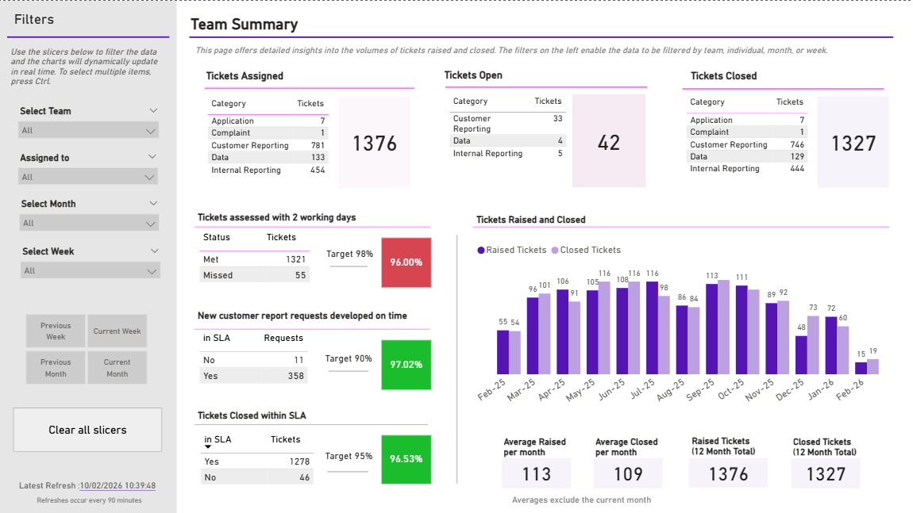
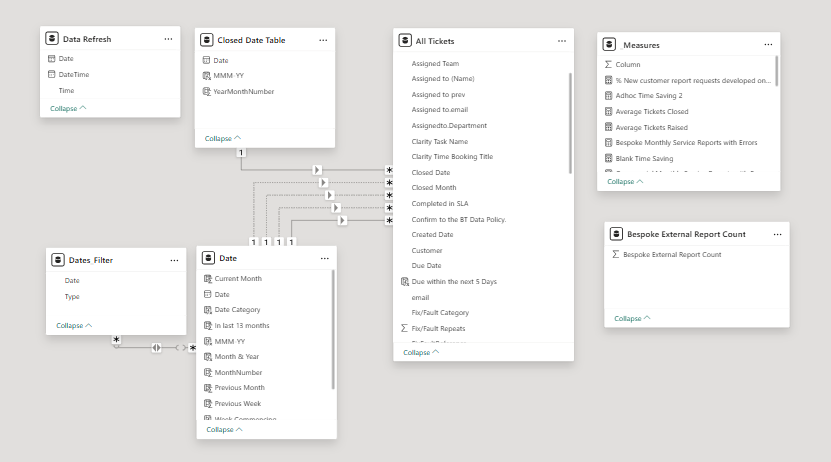

# callie-s_portfolio
Analytics Portfolio


# Power BI

This section of the repository contains Power BI projects focused on
business-oriented data analysis and reporting.

---

## SLA Performance & Ticket Management Dashboard

**Objective**

Analyse Ticket data to monitor SLA performance, identify delays in resolution, and highlight trends in ticket volume to support operational decision-making. 

**Key questions**
- Are SLAs being met (assessment within 2 days, resolution before due date)?
- Which team members handle the highest ticket volumes?
- Is ticket demand increasing over time?
- Where are delays occurring in the ticket lifecycle?


**Core visuals**
- Tickets volumes that are Assigned, Opened and Closed
- KPI percentages


<p align="center">
  
</p>

**Data Model**

- Star schema structure linking ticket fact table to dimension tables. Designed to enable efficient filtering and time-based analysis. Data was merged and cleansed in Power Query.

<p align="center">
  


  
**Key Insights**
- Majority of tickets meet SLA for resolution, but assessment within 2 days shows occasional drops (~94% in some months). A KPI alert was created in Power BI Service to notify managers of SLA breaches
- Ticket volume is relatively stable with seasonal fluctuations around August and December.
- A small number of team members handle a disproportionate number of tickets
- Closure rates closely track ticket creation, indicating steady backlog management
- Tickets were found to be out of SLA incorrectly, due to different SLA definitions between teams.

**Recommendations**
- Investigate teams / team members with lower SLA performance to identify root causes of delays
- Review ticket distribution across employees to ensure balanced workload
- Analyse periods with SLA dips to determine if driven by volume spikes or complexity
- Introduce early warnings or alerts for tickets at risk of breaching SLA
- Introduce a consistent KPI definition across all teams to standardise performance reporting


**Skills & Tools demonstrated**
- Power BI
- Power Query (to cleanse and merge the data)
- DAX (measures, calculated columns)
- Data modelling
- Interactive dashboards (filters, drill-throughs)

<br>
<br>
<br>

---

<br>
<br>
<br>

## Time Booking Performance & Resource Optimisation Dashboard

**Objective**

Deliver a scalable self-service solution through Power BI that replaces manual Excel reporting, driving real-time visibility of time booking and enabling better resourcing decisions, improved utilisation, and stronger financial control.

**Key questions**
- Are employees overbooking or underbooking against contracted hours?
- Which contracts are over- or under-resourced?
- How much time is booked to recoverable vs non-recoverable (overhead) codes?
- Who has missing or late timesheet submissions?
- How does actual booking compare to forecasted/assigned hours?
- Which teams or individuals are driving discrepancies?


**Data Cleanse**

Standardised and cleaned the data across multiple datasets in Power Query. This included removing duplicate entries, normalising columns to ensure accurate joins, transforming date field to support time-based analysis, validating mappings and reducing unnecessary columns/ cardinality


**Core Visuals**

Data has been anonymised
<p align="center">
  
</p>

**Data Model**

- Developed a star schema for improved performance and scalability. Integrated additional datasets (contract pipeline / assigned hours) to enable forecast comparisons. Established relationships using unique keys and validated join integrity

<p align="center">
  


**DAX Calculations**
- Calculated the % of codes booked that are recoverable.
  
<p align="center">
  

<br>
<br>
<br>

- Calculates the volume of contracts booked.
  
<p align="center">
  

  
**Key Insights**
- A significant proportion of hours were consistently booked to overhead rather than recoverable work
- Multiple contracts showed persistent underbooking, indicating potential resourcing gaps
- A small number of employees contributed disproportionately to overbooking instances
- Certain JA codes (e.g. support/non-productive) dominated time allocation
- Forecast vs actual analysis highlighted misalignment between planned and delivered effort
- Booking compliance varied significantly between teams, highlighting inconsistent behaviours
- Certain JA codes were misaligned to overhead or recoverable


**Recommendations**
- Strengthen governance through standardised JA codes, improved booking practices, and clear categorisation of overhead, recoverable, and customer work
- Introduce monitoring to drive accountability and visibility of booking behaviour
- Use alerts to proactively flag missing, late, or non-compliant timesheet entries
- Investigate underbooked contracts to determine whether there are resourcing gaps or reduced demand are the root cause
- Analyse high overhead usage at employee level to identify opportunities to improve utilisation and financial performance


**Skills & Tools demonstrated**
- Power BI (data modelling, DAX, visual design, performance optimisation)
- Power Query (data transformation, cleansing, merging datasets)
- Data Modelling (star schema, relationships, optimisation techniques)
- Stakeholder Management (requirements gathering, iterative delivery, feedback loops)
- Business Understanding (resource management, utilisation, financial governance)


<br>
<br>
<br>

---

<br>
<br>
<br>

# SQL

This section contains a SQL project focused on
business-oriented data analysis and reporting.

---

## Product Data Quality & Pricing Analysis

**Objective**

Improve data quality across product data and perform SQL-based analysis to enable pricing and demand insights across a product portfolio.

**Key questions**

- Are there data quality issues impacting reporting and analysis?
- Which product categories show the greatest variation in pricing?
- Are there gaps in price coverage across categories (low vs high cost offerings)?
- Which products demonstrate consistently high demand?
- Is critical metadata (e.g. product introduction year) complete and reliable?
- How can data be standardised to support consistent downstream reporting?

**Data Cleanse**

Standardised and cleaned the dataset using SQL transformations to ensure consistency and reliability for analysis. This included identifying missing critical fields, handling null values, and applying business rules to produce an analysis-ready dataset without modifying the source table.
- Replaced missing categorical values with ‘Unknown’
- Imputed missing numeric values (price, weight) using median calculations
- Defaulted missing activity metrics to 0
- Corrected formatting issues (numeric precision, casing, string parsing)
- Quantified impact of missing year_added values caused by a system defect

**Core SQL Logic**

- Validation checks to identify missing or inconsistent data
- Data standardisation using CTEs and transformation layers
- Median-based imputation using percentile_cont
- Aggregations to analyse pricing distribution by category 
- Filtering logic to isolate high-demand segments

**Example Queries**


```SQL
-- Identify how many records are missing 'year_added' data
-- This highlights data quality issues that could impact reporting
SELECT COUNT(*) AS missing_year
FROM products
WHERE year_added IS NULL;

```
```SQL

-- Clean and standardise dataset
WITH products_standardised AS (
    SELECT 
        product_id,
        product_type,
        REPLACE(brand, '-', NULL) AS brand,
        ROUND(CAST(split_part(weight, ' ', 1) AS numeric), 2) AS weight,
        ROUND(CAST(price AS numeric), 2) AS price,
        average_units_sold,
        year_added,
        UPPER(stock_location) AS stock_location
    FROM products
),
aggregations AS (
    SELECT
        percentile_cont(0.5) WITHIN GROUP (ORDER BY price) AS median_price,
        percentile_cont(0.5) WITHIN GROUP (ORDER BY weight) AS median_weight
    FROM products_standardised
)
SELECT 
    product_id,
    COALESCE(product_type, 'Unknown') AS product_type,
    COALESCE(brand, 'Unknown') AS brand,
    COALESCE(weight, median_weight) AS weight,
    COALESCE(price, median_price) AS price,
    COALESCE(average_units_sold, 0) AS average_units_sold,
    COALESCE(year_added, 2022) AS year_added,
    COALESCE(stock_location, 'Unknown') AS stock_location
FROM products_standardised
CROSS JOIN aggregations;
```
```SQL
-- Pricing range by category
SELECT
    product_type,
    MIN(price) AS min_price,
    MAX(price) AS max_price
FROM products
GROUP BY product_type;

```
```SQL
-- High-demand segment analysis
SELECT product_id, price, average_units_sold
FROM products
WHERE product_type IN ('Meat', 'Dairy')
  AND average_units_sold &gt; 10;
```

**Key Insights**

- Data quality gaps (e.g. missing year_added) introduce risk to reporting accuracy
- Pricing varies significantly across categories, indicating inconsistent pricing structure
- Some categories lack balanced price coverage across cost tiers
- High-demand items are concentrated within specific segments
- Incomplete attributes reduce confidence in downstream analysis


**Recommendations**

- Implement validation rules to prevent missing critical attributes
- Standardise data quality checks across datasets
- Review pricing structures to ensure balanced coverage across price points
- Introduce automated monitoring to flag data quality issues
- Enhance datasets with additional contextual data to improve analysis


**Skills & Tools demonstrated**
- SQL (CTEs, aggregations, filtering, window functions)
- Data Cleaning & Transformation (null handling, standardisation, validation)
- Data Quality Management (completeness, consistency, integrity checks)
- Analytical Thinking (segmentation, pattern identification)
- Business Understanding (data governance, pricing analysis, reporting readiness)

<br>
<br>
<br>

---

<br>
<br>
<br>
